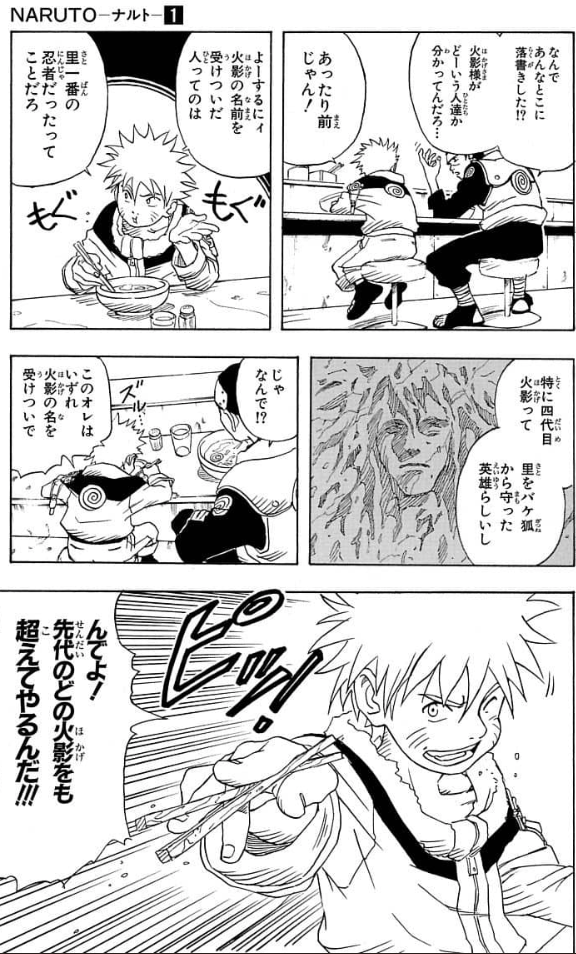
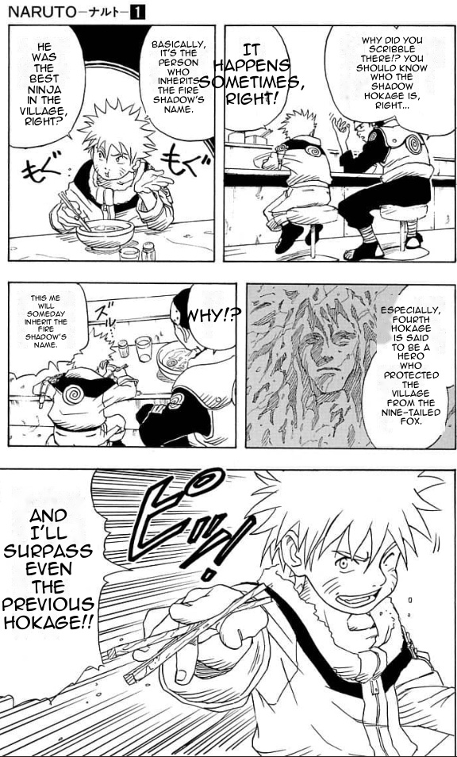
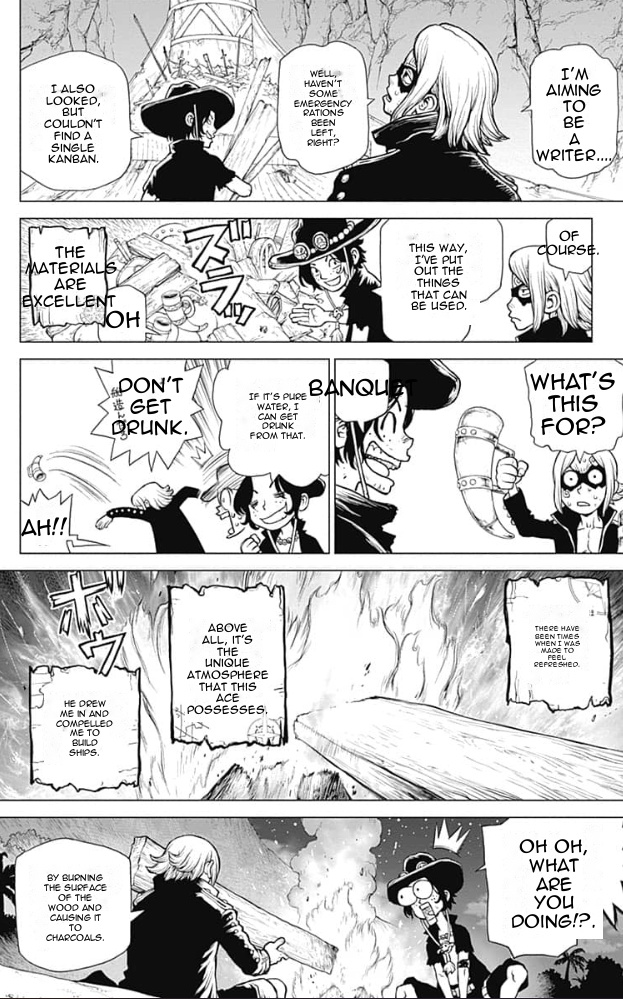

(Simple UI FORK + Experimental Multilanguage)

#  ----------------------------------------  #
#   Manga AI Translator SIMPLE UI FEATURES   #
#  ----------------------------------------  #

Run 
python ui.py

In Browser
http://127.0.0.1:7860/

- Drag and Drop 
- Language Selection
- Pause and Resume
- -LLM Selection

---------------------
# 🏯 Manga AI Translator 

An automated, privacy-focused, GPU-accelerated pipeline to translate manga and comics locally.

This project aims to provide a full-stack solution (Frontend, Backend, and AI Worker) to detect text bubbles, perform OCR, translate contextually using LLMs, and typeset the result back into the original image—all without external APIs or recurring costs.

## 🏗️ Architecture

The project follows a Microservices architecture to ensure the heavy AI processing doesn't block the web server.


## 🧩 Project Structure

| Module         | Status     | Description                                                                      |
| -------------- | ---------- | -------------------------------------------------------------------------------- |
| `/ai-worker`   | ✅ v10.0   | The core Python engine. Handles Computer Vision, OCR, and LLM Inference on GPU.  |
| `/backend-api` | 🚧 Planned | High-performance API (Go/NestJS) to handle uploads, queues, and file serving.    |
| `/frontend`    | 🚧 Planned | Modern Web UI (React) for drag-and-drop uploads and reading translated chapters. |

## ✨ Key Features (AI Worker V10)

The core engine is currently fully operational.

**📊 Perfs (RTX 2060 12GB)**:

- 29 pages/minute
- ~1,700 pages/hour
- Batch processing (.zip native)

- **⚡ 100% Local & Uncensored**: Powered by llama.cpp and Abliterated models. No moralizing, just translation.
- **👁️ Smart Detection**: Uses YOLOv8 fine-tuned on Manga109 to detect speech bubbles.
  - Smart Box Merging automatically consolidates fragmented vertical text bubbles.
- **📖 Specialized OCR**: Uses MangaOCR to handle vertical Japanese text and handwritten fonts.
- **🧠 Context-Aware Translation**:
  - Uses Qwen 2.5 7B (Instruction tuned).
  - Custom prompt engineering to handle "Subject-less" Japanese sentences.
  - "Anti-Thinking" regex filters to remove internal LLM monologues.
- **🎨 Advanced Typesetting**:
  - **NEW (V10)**: **Intelligent Masked Inpainting** - Uses OpenCV threshold detection and cv2.inpaint to remove ONLY dark text pixels, preserving artwork and backgrounds even when bounding boxes overlap.
  - **Pixel-Perfect Wrapping**: Custom algorithm measuring exact pixel width of words to avoid overflow.
  - **Sanitization**: Filters out unsupported characters (emojis, math symbols) to prevent font rendering glitches.
- **📦 Batch Processing**: Native support for .zip archives (extract → translate → repack).
- **🏗️ Modular Architecture**: Clean, maintainable codebase with separation of concerns for easy customization and extension.

## 📸 Examples

See the V10 intelligent masked inpainting in action! These examples showcase the ability to preserve artwork while cleanly removing text.

### Example 1: Naruto

<table>
<tr>
<td width="50%">

<p align="center"><b>Original (Japanese)</b></p>
</td>
<td width="50%">

<p align="center"><b>Translated (English)</b></p>
</td>
</tr>
</table>

### Example 2: One Piece

<table>
<tr>
<td width="50%">

<p align="center"><b>Original (Japanese)</b></p>
</td>
<td width="50%">

<p align="center"><b>Translated (English)</b></p>
</td>
</tr>
</table>

**V10 Improvements Demonstrated:**

- Clean text removal without damaging background artwork
- Preserved bubble borders and shading
- Accurate text positioning and sizing
- No artifacts in overlapping bubble regions

---

## 🚀 Getting Started (Worker Only)

Currently, you can run the worker as a CLI tool.

### Prerequisites

- NVIDIA GPU with 6GB+ VRAM (Recommended: 8GB+).
- CUDA Toolkit 12.x installed.
- Python 3.10+.

### Setup

1. Navigate to the worker directory:

```bash
cd ai-worker
```

2. Install dependencies (ensure CUDA support):

```bash
pip install -r requirements.txt
```

See inner README for detailed llama-cpp-python compilation instructions.

3. Run on an image or a zip file:

```bash
python main.py ../my_manga_chapter.zip
```


## 🗺️ Roadmap

- [x] Core AI Pipeline (Detection, OCR, Translation, Inpainting)
- [x] GPU Optimization (VRAM management, 4-bit quantization)
- [x] Smart Typesetting (Pixel wrapping, box merging)
- [x] Modular Code Architecture (Config, Services, Utils separation)
- [ ] Backend API (Go/NestJS setup, Redis integration)
- [ ] Frontend UI (React, File upload zone, Gallery)
- [ ] Docker Compose (One command deployment)

## 🤝 Credits

- **Models**: Qwen (Alibaba Cloud), YOLOv8 (Ultralytics), MangaOCR (kha-white).
- **Tech**: Llama.cpp, PyTorch, Pillow.

---

**Current Version**: V10 (Stable) - Intelligent Masked Inpainting

See [CHANGELOG](ai-worker/CHANGELOG.md) for detailed version history.
